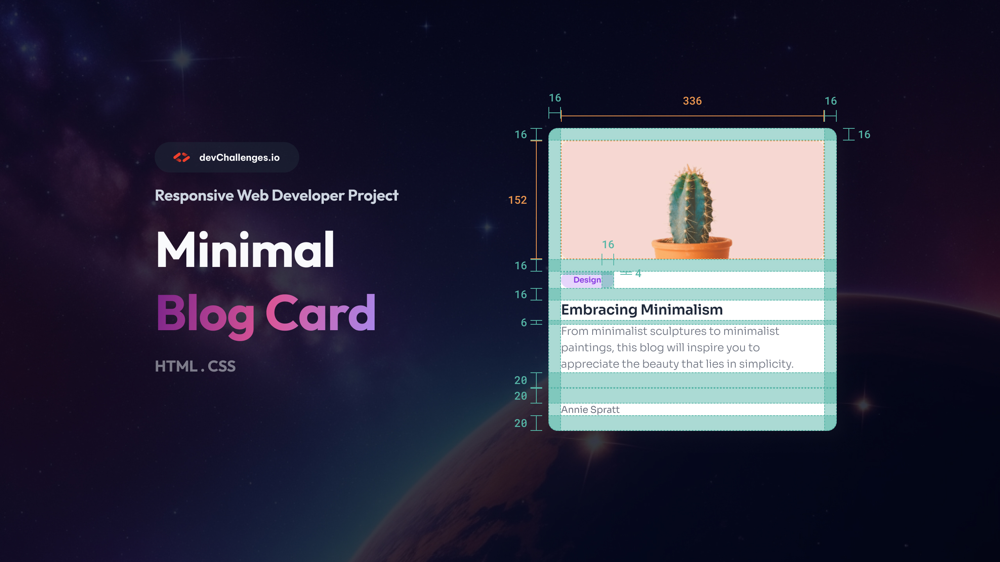

## Minimal Blog Card

This challenge is a great way to start with basic HTML and CSS skills. The challenge is to create a simple blog card that includes an image, a title, a short description, and a tag.

Link: https://devchallenges.io/editor/solution/4329

### User stories

[] Create a card component that matches the given design.

[] Use HTML to create the basic structure.

[] Use CSS to style the card.
